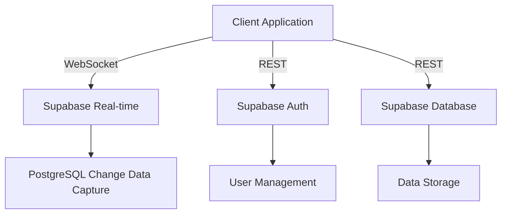

# 🐸 Froggy - Discord-Inspired Social Platform with Real-time Capabilities

## 📋 Table of Contents
- [System Architecture](#-system-architecture)
- [Database Schema](#-database-schema)
- [Authentication Flow](#-authentication-flow)
- [Data Flow & State Management](#-data-flow--state-management)
- [Real-time Implementation](#-real-time-implementation)
- [Security Model](#-security-model)
- [UI/UX Architecture](#-uiux-architecture)
- [Technical Stack](#-technical-stack)
- [Setup & Development](#-setup--development)

## 🏗 System Architecture

### Core Systems Integration


### Data Flow Architecture
1. **Authentication Layer**
   - JWT-based authentication via Supabase Auth
   - Token refresh mechanism with auto-retry on 401
   - Session persistence in localStorage
   - Real-time session synchronization across tabs

2. **State Management**
   - React Query for server state
   - React Context for global UI state
   - Local component state for UI-specific logic
   - Optimistic updates for real-time operations

3. **Real-time System**
   - WebSocket connections for:
     - Message delivery
     - Presence tracking
     - Voice state
     - Typing indicators
   - Automatic reconnection with exponential backoff
   - Message queue for offline support

## 💾 Database Schema

### Core Tables Detail

#### `profiles` Table
```sql
CREATE TABLE profiles (
    id UUID PRIMARY KEY REFERENCES auth.users,
    username TEXT NOT NULL,
    avatar_url TEXT,
    status user_status DEFAULT 'OFFLINE',
    custom_status TEXT,
    voice_settings JSONB DEFAULT '{
        "input_device": null,
        "output_device": null,
        "input_volume": 100,
        "output_volume": 100,
        "vad_sensitivity": 50,
        "noise_suppression": true,
        "echo_cancellation": true
    }',
    notification_preferences JSONB DEFAULT '{
        "desktop_notifications": true,
        "sound_notifications": true,
        "mention_notifications": true,
        "message_notifications": "mentions",
        "custom_sounds": {}
    }'
);
```

#### `servers` Table
```sql
CREATE TABLE servers (
    id UUID PRIMARY KEY DEFAULT gen_random_uuid(),
    name TEXT NOT NULL,
    icon_url TEXT,
    owner_id UUID REFERENCES auth.users,
    verification_level INTEGER DEFAULT 0,
    metadata JSONB DEFAULT '{
        "boost_status": null,
        "verification_level": 0,
        "features": {
            "community": false,
            "welcome_screen": {
                "enabled": false,
                "description": null,
                "welcome_channels": []
            }
        }
    }'
);
```

#### `channels` Table
```sql
CREATE TYPE channel_type AS ENUM ('TEXT', 'VOICE', 'ANNOUNCEMENT');

CREATE TABLE channels (
    id UUID PRIMARY KEY DEFAULT gen_random_uuid(),
    server_id UUID REFERENCES servers ON DELETE CASCADE,
    category_id UUID REFERENCES categories,
    name TEXT NOT NULL,
    type channel_type DEFAULT 'TEXT',
    position INTEGER DEFAULT 0,
    topic TEXT,
    settings JSONB DEFAULT '{
        "slowmode": 0,
        "nsfw": false,
        "require_verification": false
    }'
);
```

### Relationship Tables & Foreign Keys

#### Server Membership
```sql
CREATE TABLE server_members (
    id UUID PRIMARY KEY DEFAULT gen_random_uuid(),
    server_id UUID REFERENCES servers ON DELETE CASCADE,
    user_id UUID REFERENCES auth.users,
    nickname TEXT,
    roles JSONB DEFAULT '[]',
    joined_at TIMESTAMPTZ DEFAULT now()
);
```

#### Channel States
```sql
CREATE TABLE channel_member_states (
    id UUID PRIMARY KEY DEFAULT gen_random_uuid(),
    channel_id UUID REFERENCES channels ON DELETE CASCADE,
    user_id UUID REFERENCES auth.users,
    last_read_at TIMESTAMPTZ DEFAULT now(),
    mention_count INTEGER DEFAULT 0,
    muted BOOLEAN DEFAULT false
);
```

## 🔐 Security Model

### Row Level Security (RLS) Policies

#### Server Access
```sql
CREATE POLICY "Servers are viewable by authenticated users"
ON servers FOR SELECT
TO authenticated
USING (true);

CREATE POLICY "Servers can be created by authenticated users"
ON servers FOR INSERT
TO authenticated
WITH CHECK (owner_id = auth.uid());
```

#### Member Access
```sql
CREATE POLICY "Members can view their own memberships"
ON server_members FOR SELECT
TO authenticated
USING (
    user_id = auth.uid() OR
    EXISTS (
        SELECT 1 FROM servers
        WHERE servers.id = server_members.server_id 
        AND servers.owner_id = auth.uid()
    )
);
```

### Permission System

1. **Role Hierarchy**
   ```typescript
   interface Role {
     id: string;
     name: string;
     permissions: Permissions;
     position: number;
     color?: string;
   }
   ```

2. **Permission Flags**
   ```typescript
   interface Permissions {
     MANAGE_SERVER: boolean;
     MANAGE_CHANNELS: boolean;
     MANAGE_ROLES: boolean;
     MANAGE_MESSAGES: boolean;
     // ... other permissions
   }
   ```

## 🔄 Real-time Implementation

### Message Synchronization
```typescript
// Message subscription setup
const channel = supabase
  .channel('public:messages')
  .on(
    'postgres_changes',
    {
      event: 'INSERT',
      schema: 'public',
      table: 'messages',
      filter: `channel_id=eq.${channelId}`
    },
    (payload) => {
      // Handle new message
      queryClient.setQueryData(['messages', channelId], (old) => ({
        ...old,
        messages: [...old.messages, payload.new]
      }));
    }
  )
  .subscribe();
```

### Presence System
```typescript
// User presence tracking
const presence = supabase
  .channel('online_users')
  .on('presence', { event: 'sync' }, () => {
    const state = presence.presenceState();
    setOnlineUsers(state);
  })
  .subscribe();
```

## 🎨 UI/UX Architecture

### Component Hierarchy
```
App
├── AuthProvider
│   ├── ProtectedRoute
│   └── AuthenticatedLayout
├── ServerLayout
│   ├── ServerList
│   ├── ChannelSidebar
│   └── ServerContent
└── MessageArea
    ├── MessageList
    ├── MessageInput
    └── MembersList
```

### State Management Structure
```typescript
// Global state (React Context)
interface GlobalState {
  currentUser: User | null;
  selectedServer: Server | null;
  selectedChannel: Channel | null;
  onlineUsers: Set<string>;
  notifications: Notification[];
}

// Server state (React Query)
const { data: servers } = useQuery({
  queryKey: ['servers'],
  queryFn: fetchServers
});

const { data: channels } = useQuery({
  queryKey: ['channels', serverId],
  queryFn: () => fetchChannels(serverId)
});
```

## 🛠 Technical Implementation

### Authentication Flow
1. User submits credentials
2. Supabase Auth validates and returns JWT
3. JWT stored in localStorage
4. AuthProvider context updates
5. Real-time subscriptions established
6. Profile data fetched

### Message Flow
1. User sends message
2. Optimistic update to UI
3. Message sent to Supabase
4. Real-time event broadcasted
5. Other clients receive update
6. Message stored in database

### Voice Chat Implementation
1. WebRTC connection established
2. Voice state tracked in database
3. Real-time updates for user states
4. Media stream handling
5. Voice activity detection

## 🚀 Setup & Development

### Prerequisites
- Node.js 16+
- npm or yarn
- Supabase account

### Environment Setup
```bash
# Clone repository
git clone <repository-url>

# Install dependencies
npm install

# Start development server
npm run dev
```

### Database Setup
1. Create Supabase project
2. Run migration scripts
3. Configure RLS policies
4. Set up real-time subscriptions
5. Enable authentication providers

## 📚 API Documentation

### Server Management
```typescript
// Create server
const createServer = async (name: string): Promise<Server> => {
  const { data, error } = await supabase
    .rpc('create_server', { server_name: name });
  if (error) throw error;
  return data;
};

// Join server
const joinServer = async (inviteCode: string): Promise<void> => {
  const { error } = await supabase
    .from('server_members')
    .insert([{ server_id: serverId }]);
  if (error) throw error;
};
```

### Message Operations
```typescript
// Send message
const sendMessage = async (
  channelId: string,
  content: string
): Promise<Message> => {
  const { data, error } = await supabase
    .from('messages')
    .insert([{ channel_id: channelId, content }])
    .select()
    .single();
  if (error) throw error;
  return data;
};
```

## 🧪 Testing Strategy

1. **Unit Tests**
   - Component testing with React Testing Library
   - Utility function testing with Jest
   - Form validation testing

2. **Integration Tests**
   - API integration testing
   - Authentication flow testing
   - Real-time functionality testing

3. **End-to-End Tests**
   - User journey testing with Cypress
   - Cross-browser compatibility
   - Performance testing

## 📈 Performance Optimization

1. **Query Optimization**
   - Cursor-based pagination
   - Selective column fetching
   - Optimistic updates
   - Query caching

2. **Asset Optimization**
   - Image compression
   - Lazy loading
   - Code splitting
   - Bundle optimization

## 🔐 Security Measures

1. **Data Protection**
   - JWT authentication
   - RLS policies
   - Input sanitization
   - XSS prevention

2. **Rate Limiting**
   - API request limiting
   - Message rate limiting
   - Connection throttling

## 🌐 Deployment

1. **Production Setup**
   - Environment configuration
   - SSL certification
   - Database indexing
   - Cache configuration

2. **Monitoring**
   - Error tracking
   - Performance monitoring
   - Usage analytics
   - Real-time metrics

## 📄 License

This project is licensed under the MIT License - see the LICENSE file for details.
